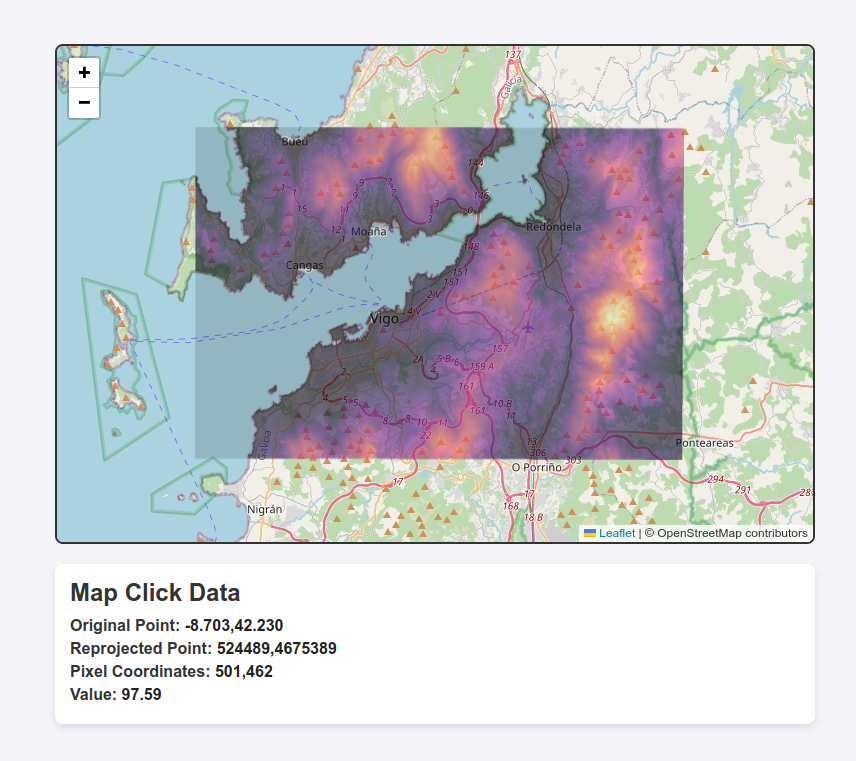
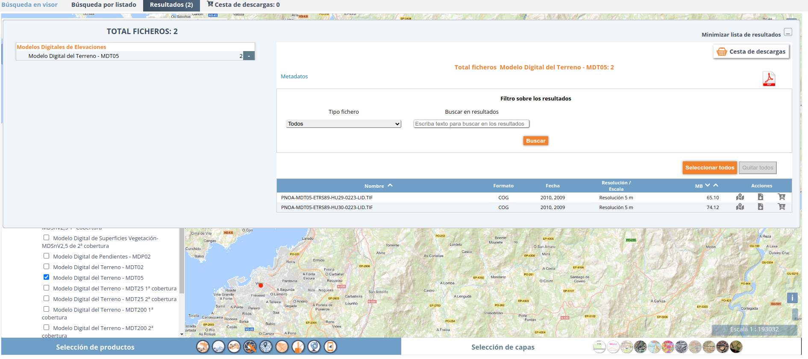

# Leaflet, geotiff.js y Cloud Optimized GeoTIFF

Tradicionalmente cuando queríamos trabajar con información ráster como un mapa de elevaciones (MDT) o de temperaturas en un visor web dependíamos del uso de un _backend_ como GeoServer. Pero ya hace unos cuantos años que formatos como Cloud Optimized GeoTiff y librerías cómo `geotiff.js` permiten en muchos casos de uso hacerlo únicamente con tecnologías en cliente.

En este artículo veremos cómo obtener el valor del pixel de un MDT al hacer click en un visor web hecho con Leaflet y cómo pintarlo de forma poco fina pero suficiente en muchos casos.

El visor final [se puede ver en esta página](https://icarto.github.io/examples/leaflet-geotiff/), y el ejemplo de código completo [en este repositorio](https://github.com/iCarto/examples/tree/development/leaflet-geotiff).



## Cloud Optimized GeoTIFF

Un fichero TIFF es un formato estándar para almacenar información ráster y metadatos asociados en un único archivo. Pero debemos entenderlo como algo genérico cuantas imágenes se almacenan en el fichero o cómo están comprimidas está abierto para quien crea el TIFF. Podríamos imaginarlo como un contenedor de carga estándar de un barco que puede transportar dentro diferentes tipo de mercancía siendo la organización interna decidida por quien lo llena.

Un GeoTIFF es una extensión del formato TIFF para manejar información geográfica. Amplía el estándar para almacenar información como coordenadas proyección ... Forzando un poco la comparación anterior sería cómo decir que dentro del contenedor toda la carga debe ir almacenada en cajas de un determinado tamaño.

Un [Cloud Optimized GeoTIFF](https://cogeo.org/in-depth.html) (COG) es una especialización del formato GeoTIFF diseñada fundamentalmente para acceder a una "parte" del ráster a través de internet. Sería algo así como especificar cómo tienen que estar ordenadas las cajas para que si sólo necesitamos una de ellas podamos cogerla por separado sin tener descargar el contenedor entero.

Los COG se basan en dos técnicas que ya existían para los GeoTiff: Tiles y Overviews. Evitando las precisiones técnicas:

-   Los tiles dividen la imagen en "horizontal" (_pan_ por decirlo de alguna forma). Si tenemos una imagen tileada de toda España pero sólo nos interesa una zona no es necesario descargar toda la imagen si no sólo las tiles de la región que nos interesa.
-   Los overviews dividen la imagen en "vertical" (_zoom_). Si estamos viendo la imagen de toda España generaremos una versión resumida no interesan los detalles concretos si no la vista global. Si hacemos zoom a un punto concreto aumentaremos los detalles pero sólo para esa zona.

Ambas técnicas se pueden combinar o no según lo que interese para poner en cajas concretas dentro de nuestro contenedor niveles determinados de zoom y pan. El TIFF almacena de forma eficiente cómo metadatos ese orden de forma que una vez descargando el "índice de contenidos" lo que sólo tenemos que hacer una vez podamos ir a buscar directamente (descargar) la caja que nos interese.

Las otras dos piezas del puzle para hacer visores estáticos que aprovechen los COG son:

-   [HTTP range requests](https://developer.mozilla.org/en-US/docs/Web/HTTP/Range_requests). `range requests` es una característica del protocolo HTTP el que usamos para acceder a una página web que permite descargar partes específicas de un archivo en lugar del fichero completo.
-   Librerías cómo [geotiff.js](https://geotiffjs.github.io/) que interpretan los ficheros COG y usan `HTTP range requests` para leerlos.

## Leaflet geotiff.js y COG

Librerías cómo [OpenLayers](https://openlayers.org/en/latest/examples/index.html?q=cog) y [MapLibre](https://github.com/geomatico/maplibre-cog-protocol) tienen buen soporte para COG pero Leaflet no.

Lo que podemos hacer en Leaflet si no queremos complicarnos es:

-   Usar geotiff.js para consultar el valor de pixel del COG.
-   Generar una pequeña imagen .png ya renderizada que cargaremos con [ImageOverlay](https://leafletjs.com/reference.html#imageoverlay) y nos dará una visualización general del ráster.

## Preparar el ráster

Para este ejemplo descargaremos el fichero `PNOA_MDT05_ETRS89_HU29_0223_LID.tif` del centro de descargas del CNIG correspondiente al MDT05 de la zona de Vigo en EPSG:25829.



A partir del fichero original generaremos un COG y un .png renderizado. Se podría hacer con QGIS, pero en estos ejemplos lo haremos con GDAL.

### Generar el COG

Las [opciones concretas](https://gdal.org/en/latest/drivers/raster/cog.html) a emplear dependerán del caso de uso. Para nuestro ejemplo dado que no lo usaremos para visualizar y se trata de un MDT podemos usar este comando:

```bash
gdal_translate -a_srs EPSG:25829 -of COG \
    -co COMPRESS=DEFLATE -co LEVEL=9 -co PREDICTOR=YES \
    -co NUM_THREADS=ALL_CPUS --config GDAL_CACHEMAX 1500 --config GDAL_NUM_THREADS ALL_CPUS \
    \ -co BLOCKSIZE=128
    -co OVERVIEWS=NONE  PNOA_MDT05_ETRS89_HU29_0223_LID.tif output.tif
```

Notas:

-   En realidad el .tif que descargamos ya está en formato COG y no es necesario procesarlo. Pero lo hacemos por ver el proceso completo.
-   En el ejemplo subido al repositorio usamos un MDT25 para no subir ficheros pesados.

### Generar el .png

Para no complicarmos mucho generaremos un _color-relief_. Los valores de la rampa los podemos obtener de otra herramienta como QGIS. Por ejemplo:

```bash
echo "
-0.28700000047683716 0 0 0 0
1 0 0 4 255
95.78897638142109372 30 17 74 255
191.8649527633190246 84 20 125 255
287.94092914521695548 136 40 129 255
384.01690552711488635 190 58 118 255
480.09288190901281723 237 89 96 255
576.16885829091074811 253 150 104 255
664.85437495112421402 254 206 145 255
738.75897216796875 252 253 191 255
" > magma-color-relief.dat
```

Reproyectaremos el ráster para pintarlo en Leaflet y aplicaremos la rampa:

```bash
gdalwarp -t_srs EPSG:4326 PNOA_MDT05_ETRS89_HU29_0223_LID.tif pnoa05_4326.tif
gdaldem color-relief -alpha -compute_edges -of png -co ZLEVEL=9 pnoa05_4326.tif magma-color-relief.dat output.png
```

Para obtener las coordenadas a aplicar al ImageOverlay podemos usar `gdalinfo` y si tenemos la herramienta `jq` instalada:

```bash
gdalinfo -json output.png | jq '[{lng: .cornerCoordinates.upperLeft[0], lat: .cornerCoordinates.upperLeft[1]}, {lng: .cornerCoordinates.lowerRight[0], lat: .cornerCoordinates.lowerRight[1]}]'

# output
# [ {"lng": -8.8552392, "lat": 42.3347327}, { "lng": -8.5189099, "lat": 42.1652488 } ]
```

## Obtener el valor del pixel

A partir de cualquier plantilla de Leaflet generaremos nuestro código base. Al que añadiremos las librerías geotiff.js y proj4js.

Necesitamos proj4js porqué hemos optado por no reproyectar el COG para no perder precisión. Así que tendremos que transformar las coordenadas en EPSG:4326 que nos proporciona Leaflet a EPSG:25829 para poder ubicarlas en un pixel concreto.

Prepararemos la reproyección de las coordenadas con:

```javascript
let projection;

// Define the projection if not already set
const getProjection = () => {
    if (!projection) {
        // Define EPSG:25289 alias in proj4 taking values from https://epsg.io/25829
        proj4.defs(
            "EPSG:25829",
            "+proj=utm +zone=29 +ellps=GRS80 +towgs84=0,0,0,0,0,0,0 +units=m +no_defs +type=crs"
        );
        projection = proj4("EPSG:4326", "EPSG:25829");
    }
    return projection;
};

const getReprojectedCoords = latlng => {
    const proj = getProjection();
    return proj.forward({x: latlng.lng, y: latlng.lat});
};

// Show reprojected coordinates on click
map.on("click", e => {
    const {x, y} = projection.forward({x: e.latlng.lng, y: e.latlng.lat});
    console.log("Original: ", e.latlng.lng, e.latlng.lat);
    console.log("Reprojected: ", x, y);
});
```

Para trabajar con el COG primero debemos leerlo con geotiff.js. Esta operación simplemente obtiene los metadatos (70k en este caso) y no accede al ráster completo.

```javascript
const loadGeoTIFFImage = async url => {
    const tiff = await GeoTIFF.fromUrl(url);
    return tiff.getImage();
};

const initializeMap = async () => {
    const map = L.map("map").setView([42.25, -8.69], 11);

    L.tileLayer("https://{s}.tile.openstreetmap.org/{z}/{x}/{y}.png", {
        attribution: "© OpenStreetMap contributors",
    }).addTo(map);

    const image = await loadGeoTIFFImage("output.tif");
};

initializeMap();
```

Cómo geotiff.js no entiende de coordenadas, si no únicamente de píxeles convertiremos las coordenadas de Leaflet (transformadas mediante proj4) a píxeles del COG. Para ello o bien hardcodeamos los valores consultando los metadatos del COG con gdal/qgis o los obtenemos dinamicamente.

Para convertir las coordenadas a la "fila y columna" del pixel sólo hace falta un poco de matemáticas.

Hay que tener en cuenta la rotación de las imágenes, ejes invertidos y otros problemas clásicos del trabajo con GIS, pero en la versión más simple quedaría cómo:

```javascript
const handleMapClick = async ({latlng}, image) => {
    const xyCoords = getReprojectedCoords(latlng);
    const pixelCoords = calculatePixelCoords(xyCoords, image);

    console.log("Original: ", latlng);
    console.log("Reprojected: ", xyCoords);
    console.log("Pixels: ", pixelCoords);
};

const calculatePixelCoords = (xyCoords, image) => {
    const {x, y} = xyCoords;
    const [originX, originY] = image.getOrigin();
    const [xRes, yRes] = image.getResolution();

    // Reprojected point minus the raster origins divided by the pixel size to get row and column
    const pixelX = Math.floor((x - originX) / xRes);
    const pixelY = Math.floor((y - originY) / yRes);

    return [pixelX, pixelY];
};
```

Con esto sólo nos queda pedirle a geotiff.js que obtenga el valor del pixel. Esto puede originar una nueva petición HTTP si el valor todavía no ha sido cacheado.

```javascript
const handleMapClick = async ({latlng}, image) => {
    const xyCoords = getReprojectedCoords(latlng);
    const pixelCoords = calculatePixelCoords(xyCoords, image);
    const pixelValue = await getPixelValue(image, pixelCoords);

    console.log("Original: ", latlng);
    console.log("Reprojected: ", xyCoords);
    console.log("Pixels: ", pixelCoords);
    console.log("Pixels Value: ", pixelValue);
};

const getPixelValue = async (image, [pixelX, pixelY]) => {
    const [value] = await image.readRasters({
        interleave: true,
        window: [pixelX, pixelY, pixelX + 1, pixelY + 1],
        samples: [0],
    });
    return value;
};
```

## Pintar el ráster mediante ImageOverlay

Una vez tenemos el .png pintarlo en Leaflet es sólo instanciar un ImageOverlay con los bounds adecuados.

```javascript
const imageOverlayBound = [
    {lng: -8.8552392, lat: 42.3347327},
    {lng: -8.5189099, lat: 42.1652488},
];
const imageOverlay = L.imageOverlay("./output.png", imageOverlayBound, {
    opacity: 0.8,
}).addTo(map);
```

## Conclusiones

Este código necesita ser optimizado y se podría empaquetar en una librería que permitiera pintar además los COG en Leaflet sin necesidad de cargar el fichero entero de golpe, pero nos da una idea de las posibilidades.

Si te interesa financiar una librería de este tipo [ya sabes donde encontrarnos](https://icarto.es/contacta/).
